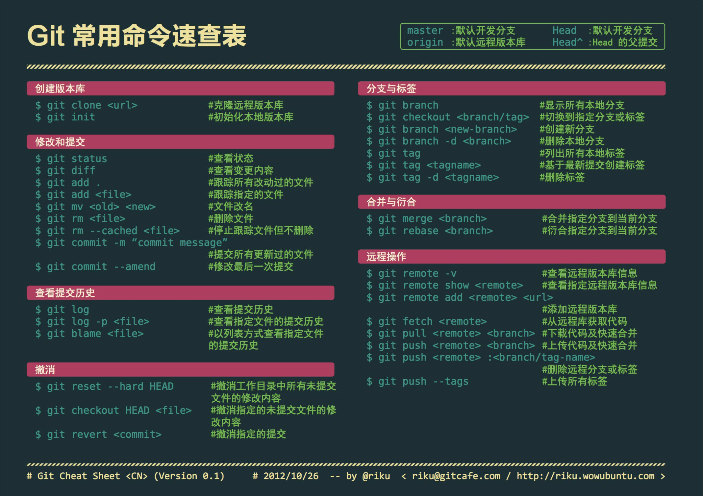
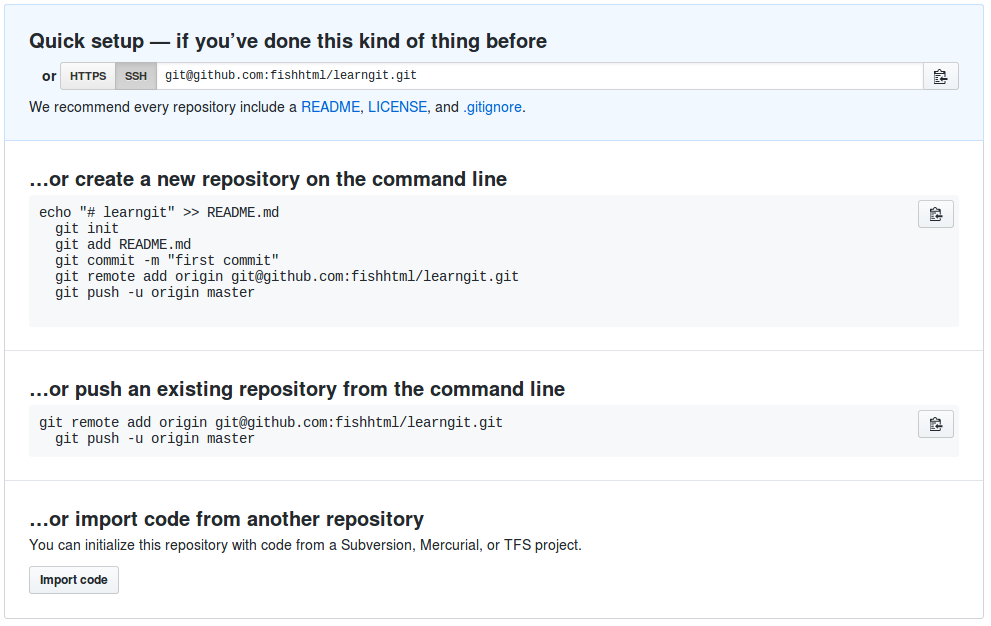

# git学习笔记

 > http://www.liaoxuefeng.com/wiki/0013739516305929606dd18361248578c67b8067c8c017b000
 > 这个教程比较简洁:http://www.bootcss.com/p/git-guide/
 > git官方教程：https://git-scm.com/book/zh/v2/%E8%B5%B7%E6%AD%A5-%E5%85%B3%E4%BA%8E%E7%89%88%E6%9C%AC%E6%8E%A7%E5%88%B6

## 速查图


## 入门第一步

 1. 新建一个空的。`git int`
 2. 将修改后的文件加到工作区(work tree)。`git add <file>`
 3. 查看当前仓库状态。`git status`
 4. 查看修改的内容。（工作区与版本库之间的区别）`git diff`
 5. 提交和并。`git commit -m "some notes"`

## 版本退回

 1. 查看修改记录。`git log`
 2. 查看简单历史记录。`git log --pretty=oneline`，出现：
```
6c2488d9db9319dfff9f08e2ad4a9b33988bc67e change once //前面的是版本号,commit id
dc2e8b56fda66800d010b6746959af858339d1dd a new file is create
```
 3. `HEAD`表示当前版本，`HEAD^`表示上一个版本。
 4. `git reset --hard HEAD^`回到上一个版本。
`git reset --hard HEAD^^`回到上上个版本。
`git reset --hard <commit id>`回到指定commit id指定版本。
 5. 查看命令历史。`git reflog`

## 工作区和暂存区


**分解原理：**


查看工作区与版本库修改内容`git diff -- HEAD <filename>`

## 撤销修改

1. 直接丢弃工作区的修改时,`git checkout -- <filename>`
2. 如果加到了暂存区，想丢弃修改，分两步。一，`git reset HEAD <filename>`;二，重复上一步。

## 删除文件

1. 删除工作区文件 `rm <filename>`
2. 同步删除状态到stage`git rm <filename>`
(可以使用`git checkout -- <filename>`取消误删除)
3. 同步删除状态到repository`git commit -m "commition"`

## 远程仓储

1. 创建SSH Key,`$ ssh-keygen -t rsa -C "youremail@example.com"`//注意pwd目录位置


```
成功在主目录下创建.ssh/id_rsa和.ssh/id_rs.pub . 前者是私钥，后者是公钥
```


2. 在github生保存公钥


`Add SSH Key --> Title --> 粘贴文本内容`


3. 如图





```
加上了-u参数，Git不但会把本地的master分支内容推送的远程新的master分支，还会把本地的master分支和远程的master分支关联起来，在以后的推送或者拉取时就可以简化命令。
```

4. 修改本地后，推送上去


`$ git push origin master`


5. clone远程仓储到本地`git clone git@github.com:nswbmw/N-blog.git`

## 分支管理

1. 查看分支。`git branch`
2. 创建分支。`git branch <branchname>`
3. 切换分支。`git checkout <branchname>`
4. 创建+切换分支。`git checkou -b <branchname>`
5. 合并某分支到当前分支。`git merge <branchname>`
6. 删除分支。`git branch -d <branchname>`

### 管理冲突

*冲突的出现：*
1. 在分支上修改readme文件后`add+commit`，
2. 然后`checkout`回`master`，
3. 修改readme文件，`add+commit`,

4. 再`merge`分支到`master`时，
5. 出现`conflict`。

```
自动合并 readme
冲突（内容）：合并冲突于 readme
自动合并失败，修正冲突然后提交修正的结果。

```

*冲突的解决*
1. `cat readme`或`less readme`查看冲突内容。下面标记出了分支的区别：

```
快速复习笔记。
每日必看。
<<<<<<< HEAD
insert new feature1
=======
insert feature1 
>>>>>>> feature1

```

2. 打开readme文件修改，readme内容此时如上：

3. `add+commit`
4. 解决


```
`git log --graph --pretty=oneline --abbrev-commit`和`git log -graph` 以命令行的形式查看图形log
```

### 分支管理策略

`merge`时，使用`--no-f`参数，即：`git merge --no-ff -m "这里可以写merge时的评论" dev`（如果不用这个参数，是无法加入评论的，在`git log`看不出曾今做过合并）

## Bug分支

*使用场景：*
1. 你正在分支dev上编写软件
2. 突然master分支上出现bug需要修复
3. Bug分支派上用场：使用`git stash`来保存当前的修改状态（work tree当前的状态）

*使用方法：*
1. `git stash`保存当前的修改状态，以便之后恢复
2. `git checkout master`回主分支
3. `git checkout -b issue-101`创建并切换到bug分支
4. 修复bug后，`git add issue-101`,`git commit -m "issue-101 fixed"`，提交修改到issue-101分支
5. `git checkout master`切换到主分支
6. `git merge --no-ff -m "issue-101 has fixed" issue-101`把修改的内容合并到主分支
7. `git branch -d issue-101`删除bug分支issue-101
8. `git checkout dev`切回到dev分支
9. `git stash list`显示所有保存的stash状态

```
$ git stash list
stash@{0}: WIP on dev: 6224937 add merge
```

10. `git stash apply stash@{0}`还原先前的work tree的状态

> `git stash apply`恢复后，stash内容并不删除
> `git stash drop`恢复后才能用,使用这条可以使stash内容被删除
> `gti stash pop`恢复的同时把stash内容也删了（上面俩者的合集）

## Feature分支

> 添加一个新功能时，你肯定不希望因为一些实验性质的代码，把主分支搞乱了，所以，每添加一个新功能，最好新建一个feature分支，在上面开发，完成后，合并，最后，删除该feature分支。

1.`git checkout -b feature-vulcan`
2. `git add vulcan.py`
3. `git commit -m "add feature vulcan"`
4. `git checkout dev`
5. 就在此时，接到上级命令，因经费不足，新功能必须取消！
6. `git branch -d feature-vulcan`，却提示：

```
error: The branch 'feature-vulcan' is not fully merged.
If you are sure you want to delete it, run 'git branch -D feature-vulcan'.
```

7. `git branch -D feature-vulcan` 强行删除

## 多人协作
 > 当你从远程仓库克隆时，实际上Git自动把本地的master分支和远程的master分支对应起来了，并且，远程仓库的默认名称是origin

### 查看相关

查看远程仓储的信息：`git remote`
查看更多详情：`git remote -v`
查看超多信息：`git remote show <remotename=origin>`

### 推送分支

推送到远程仓储：`git push [remote-name] [branch-name]`例如，`git push origin master`/`git push origin dev`//remote-name是远程服务器名称，不一定是master，其他也可

### 抓取分支

1. clone repo :`git clone git@github.com:fishhtml/learngit.git`//这里仅仅之clone了master分支，没有其他分支
2. `git checkout --track origin/dev`跟踪远程分支，也就是把远程分支dev分支下载到了本地
```
这里还有其他方法：https://git-scm.com/book/zh/v1/Git-%E5%88%86%E6%94%AF-%E8%BF%9C%E7%A8%8B%E5%88%86%E6%94%AF
```

### 案例

> A同学同步分支dev到了github，B也修改了dev分支下相同的文件，B在推送的时候会提示无法推送。这时，需要同步A同学的push，处理A/B的差异，让后B同学再提交push就可以了

*差异处理：* （B同学完成）
1. `git fetch origin dev`从origin拉取dev分支中的差异
2. `git merge`合并所有差异，前面学过哈
3. 1,2两步相当于 `git pull`
4. 如果B同学的本地有自己新建的dev分支，提交`git pull`时，本地的dev（可能不叫dev）与远端的origin/dev无法对应起来，这时，需要设置分支链接关系：`git branch --set-upstream dev origin/dev`
5. 打开文件解决差异后，push上去。
